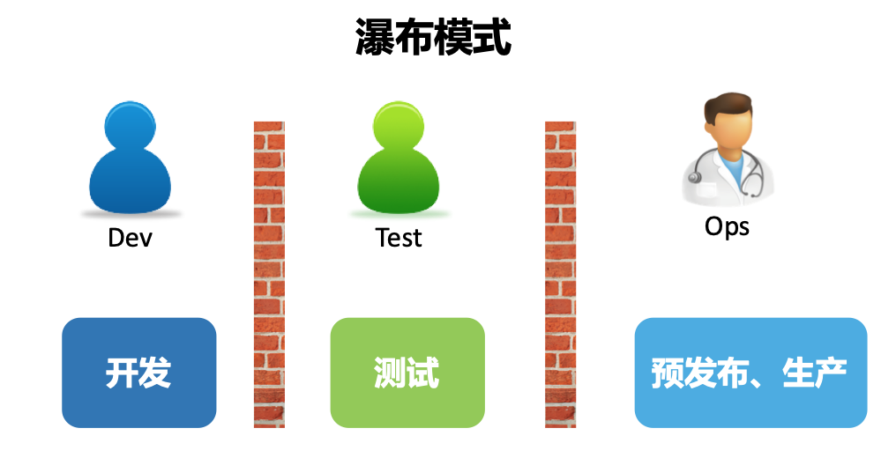
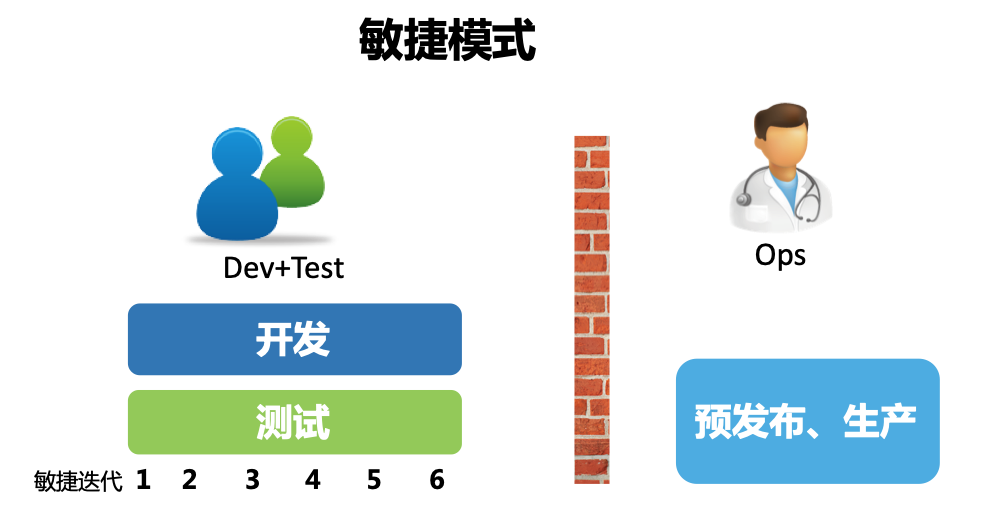
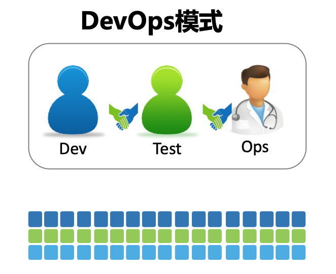

---
description:DevOps定义
---
# 什么是Devops

## DevOps的定义

首先让我们来看一下DevOps的官方定义：

>DevOps（开发Development与运维Operations的组合词）是一种文化、一场运动或实践，强调在自动化软件交付流程及基础设施变更过程中，软件开发人员与其他信息技术（IT）专业人员彼此之间的协作与沟通。它旨在建立一种文化与环境，使构建、测试、软件发布得以快速、频繁以及更加稳定地进行。

C老师（ChatGpt）给的定义：

>DevOps是一种用于提高软件开发和交付效率的实践和哲学。这个词是“开发（Development）”和“运营（Operations）”两词的结合，旨在强调开发和IT运营团队之间更紧密的合作和协调。

大神的定义：
>DevOps是通过平台（Platform）、流程（Process）和人（People）的有机整合，以C（协作）A（自动化）L（精益）M（度量）S（共享）文化为指引，旨在建立一种可以快速交付价值并且具有持续改进能力的现代化IT组织。

## DevOps的由来

### 瀑布开发模式

软件开发的规模越来越大，必须以一种工程管理的方式来定义每个阶段，以及相应的交付产物和交付标准，以期通过一种重流程，重管控，按照计划一步步推进整个项目的交付过程。

**方式**：

- 需求分析：项目初期，集中进行所有需求的详细分析和文档编写。
- 系统设计：基于需求文档，进行系统的整体设计。
- 实现编码：根据设计文档，进行编码实现。
- 系统测试：在所有模块开发完毕后进行系统测试。
- 系统部署：通过测试的系统进行部署。
- 维护：系统部署后，进行必要的维护和更新。

**优点**：

- 易于管理和计划，因为各个阶段明确分隔。
- 每一阶段有明确的交付物和里程碑。

**弊端**：

- 灵活性差：需求变更可能会导致大量的重新设计和编码。
- 测试阶段较晚，发现的问题可能需要较大的改动。
- 项目风险较高，可能在开发后期才发现重大问题。

### 敏捷开发模式

因为我们无法充分了解用户的真实需求是怎样的，那么不如将一个大的目标不断拆解，把它变成一个个可交付的小目标，然后通过不断迭代，以小步快跑的方式持续开发。与此同时，将测试工作从研发末端的一个独立环节注入整个开发活动中，对开发交付的内容进行持续验证，保证每次可交付的都是一个可用的功能集合，并且由于质量内建在研发环节中，交付功能的质量也是有保障的。

**方式**：

- 迭代开发：项目分为多个小迭代周期进行开发，每个周期包括需求分析、设计、编码和测试。
- 客户参与：客户或利益相关者在开发过程中有持续的参与。
- 响应变更：即使在开发后期也能够灵活地响应需求变更。

**优点**：

- 更高的灵活性和适应性，可以适应项目需求的变化。
- 通过频繁的迭代，可以快速得到可用的产品或功能。
- 客户参与度高，可以更好地满足客户需求。

**弊端**：

- 需要更高的客户参与度，可能增加管理复杂性。
- 有可能导致项目的方向和范围膨胀（Scope Creep）。
- 对团队的自律性和协作能力要求较高。

### DevOps

DevOps最开始想要打破的就是开发和运维之间的对立和隔阂。后来发现，其实在整个软件交付过程中，不仅只有开发和运维，业务也是重要的一环。使得DevOps由最开始的点，扩展为线，再到面，不断发展壮大。每个人都参与其中，这使得DevOps成了每一个IT从业人员都需要学习和了解的知识和技能体系。

**方式**：

- 持续集成：开发人员频繁地将代码集成到主分支。
- 持续交付：确保软件可以随时被可靠、安全地部署到生产环境。
- 持续运维：运维团队参与到开发流程中，以提高系统的可靠性和稳定性。
- 自动化：利用工具和技术来实现开发和运维流程的自动化。

**优点**：

- 提高了软件的交付速度和质量。
- 增强了开发和运维团队之间的协作和沟通。
- 通过自动化减少了人工错误和重复劳动。

**弊端：**

- 实施DevOps可能需要改变组织结构和文化，这可能是一个长期的过程。
- 需要投资于新的工具和技能培训。
- 如果没有正确实施，可能会增加系统的复杂性和风险。
